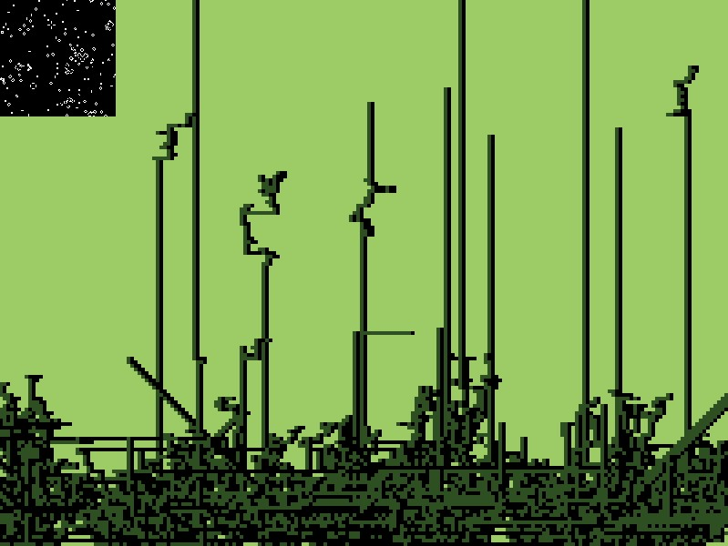
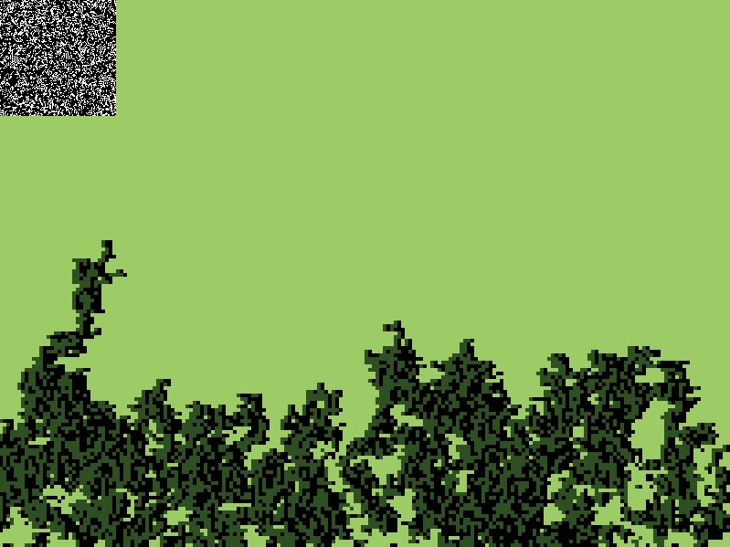
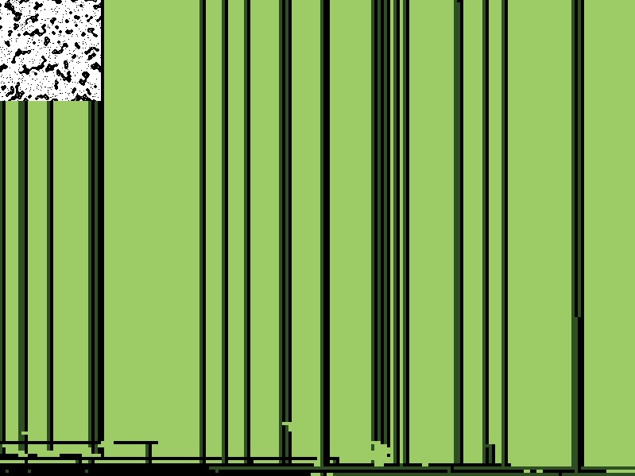
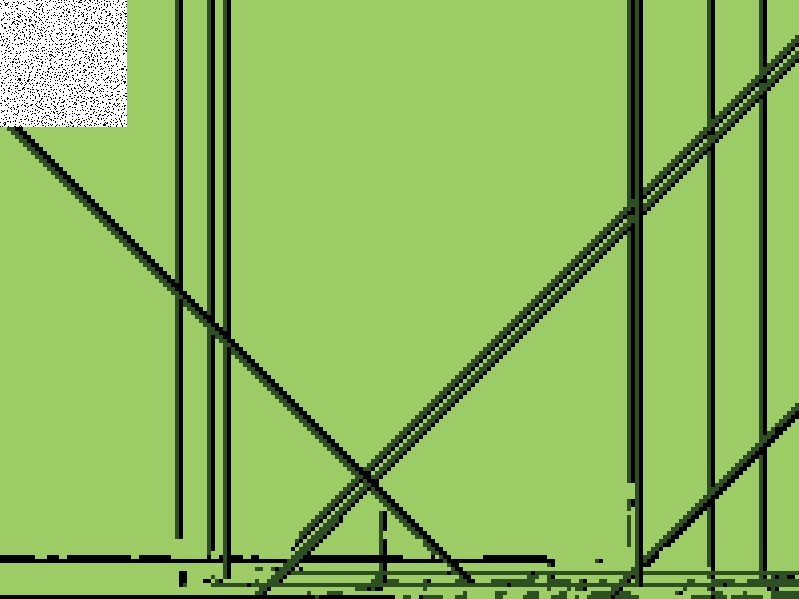

# Life Begets Life

A p5.js re-visualization of Conway's Game of Life

Copyright (C) Kyle Bouwman 2020-2021

## Description

This work is inspired by the writings of the American transcendentalist author, Ralph Waldo Emerson, who believed that God's presence in the world was apparent through the beauty of nature.

This work breathes a little bit of life into Conway's Game by re-visualizing it as trees growing in a forest.

The growth pattern of the trees is roughly based on the Lindenmayer system of modeling the growth processes of plant development.

## Examples

Here are a few examples of forests that have been made with this program, with a few modifications to the rules of either *Conway's Game of Life* or *Life Begets Life*.

### Conway's Game with life and death

### Conway's Game without death

### Conway's when 2 neighbors is not considered lonely

### Conway's when dead cells are instantly revived

### Conway's when most cells live

